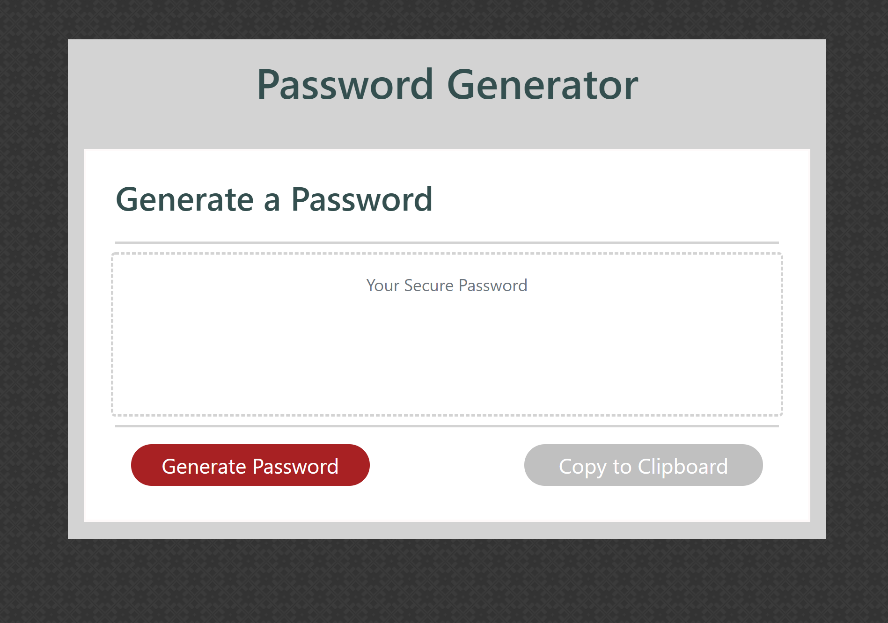

# Password_Generator
## Description

The password generator program automatically generates a randomly generated password based on the user criteria of what type of characters they would like to be included in their password.

* Character type:

  * Special characters 

  * Numeric characters

  * Lowercase characters

  * Uppercase characters

Additionally the user can also select the length of the password to be created.

* Length (must be between 8 and 128 characters)

The two buttons featured on the html page consist of:

* Generate Password Button

    * Prompts the User for:

        * The length of the password

        * If they would like to include special characters

        * If they would like to include numeric characters

        * If they would like to include lowercase characters

        * If they would like to include uppercase characters

    * Executes the code to generate a password based on the parameters

    * Updates the html webpage

        * The textarea with their new password

        * turns the Copy to Clipboard Button green

* Copy to Clipboard Button

    * copies the text in password textarea to the consoles clipboard

    * alerts the user with what has been copied

## Current Display and Link to Currently Active Site

To see the site in action please use the link below

https://bfall-debug.github.io/Password_Generator/

<<<<<<< HEAD

=======

>>>>>>> 9276143ddf8fb56ed43246dbf6687c7d5a17fc30

## List of Known Issues or Potential updates

* None - All issues have been fixed
